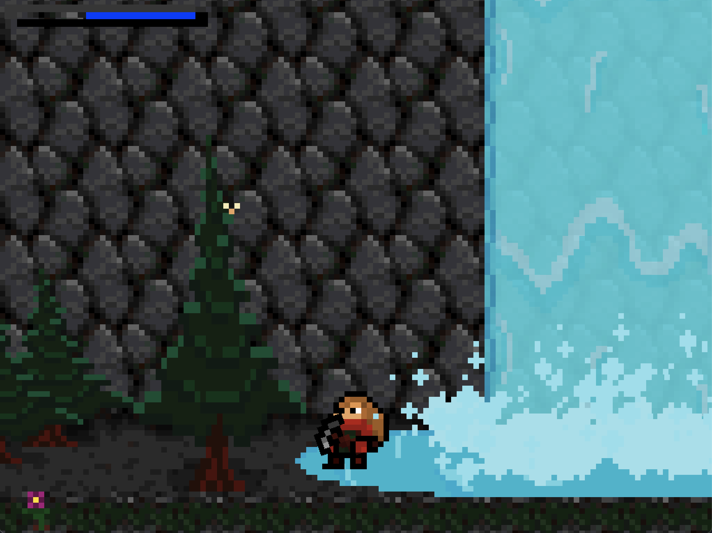

# Summary

 

***Cliffs of Akaia*** (pronounced: Uh-KAY-uh)

- 2D Side-Scrolling RPG

- Extreme Mountain Survival

- Open World Exploration

- Climbing Mechanics

- Puzzles & Secrets

- Crafting

- Emotional Story Elements

- Evolving NPC Relationships

- Procedurally-Generated Areas

- Day/Night/Season Cycles

- Complex Gameplay Depth

- Original Pixel Art

- Original 8 Bit Music

- Created with the Godot Engine

 

# Download

 

# Made With

 

# Status

 

Development Build (unstable 'develop' branch):

Release Build (stable 'master' branch):

Deployment (Itch.io):

